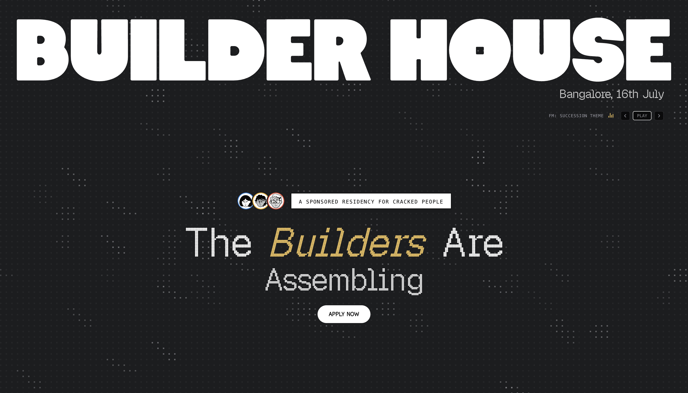

# Builder House '26 — ft. TokenSupply



A bespoke, high-contrast, premium landing page for **Builder House '26**, a fully sponsored 45-day residency in Bangalore, India for cracked engineers, designers, and founders collaborating to build and launch V1 of **TokenSupply**.

---

## 🛠️ Tech Stack & Architecture

- **Framework**: [Next.js (App Router)](https://nextjs.org/) for optimized static generation, dynamic routing, and fast load times.
- **Styling**: [Tailwind CSS v4](https://tailwindcss.com/) for fluid custom utility classes, flex layouts, and custom theme inline directives.
- **Fonts**:
  - **Geist Pixel Circle**: Premium retro-digital typography imported dynamically from `geist/font/pixel`.
  - **Instrument Serif**: Elegant, high-contrast serif typeface.
  - **Coastersans**: Bespoke geometric heading typeface loaded locally.
- **Smooth Scrolling**: Integrated [Lenis](https://github.com/darkroomengineering/lenis) smooth scrolling wrapper.
- **Interactive Audio**: Custom built FM Player utility leveraging React hooks and HTML5 Audio API mapping custom tracks.

---

## ✨ Features

- **Retro-Digital Loading Screen**: A full-viewport simulated system loader displaying loading logs with real-time percentage indicators.
- **Interactive Music Player**: A floating/inline lo-fi FM radio playlist player supporting track skips, play/pause toggles, and sound-bar visualizer micro-animations.
- **Dynamic Program Details Grid**: 6-card modular highlight system detailing key pillars of the bootcamp using custom graphic assets.
- **Subprocessor Database**: Responsive dark-mode infrastructure table listing verified service locations and purposes.
- **Roadmap (The Road to V1)**: Chronological workflow timeline mapping six development phases with visual placeholders and status icons.
- **Centered FAQ Stack**: Custom interactive accordion elements answering key logistics questions about the residency.
- **Sleek CTA Links**: Connects directly to the Luma registration workflow.

---

## 🚀 Getting Started

First, install local dependencies:

```bash
npm install
```

Start the local development server:

```bash
npm run dev
```

Open [http://localhost:3000](http://localhost:3000) in your browser to view the application.

---

## 📦 Deployment & Production Build

To build the application for production:

```bash
npm run build
```

To run the production bundle locally:

```bash
npm run start
```
